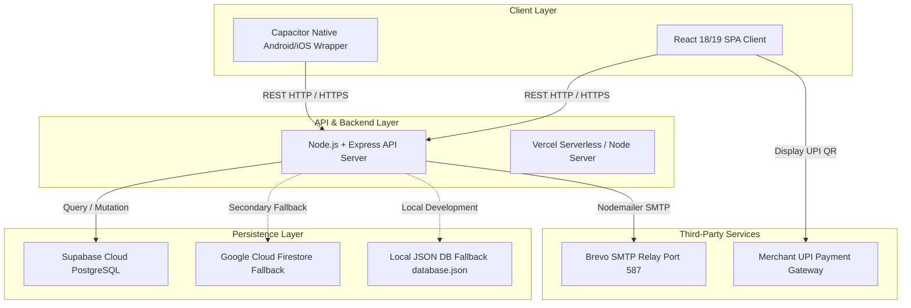
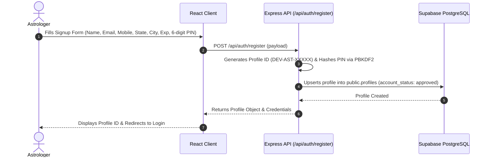
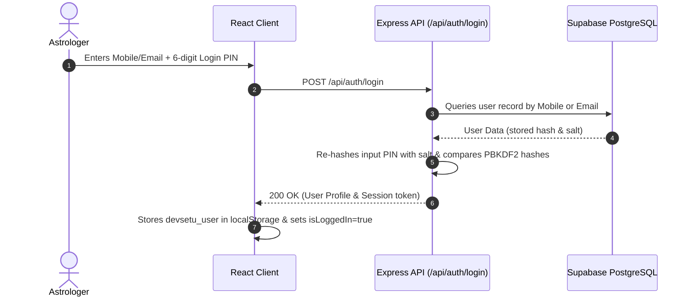
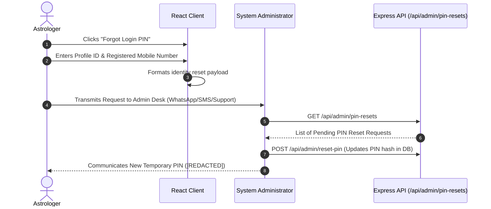
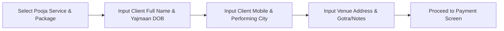
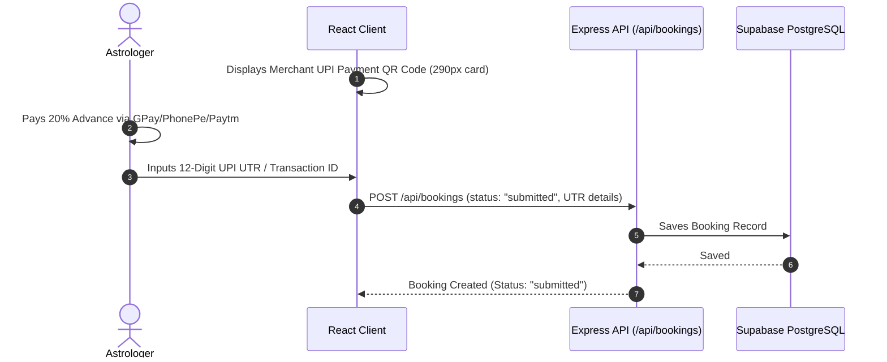
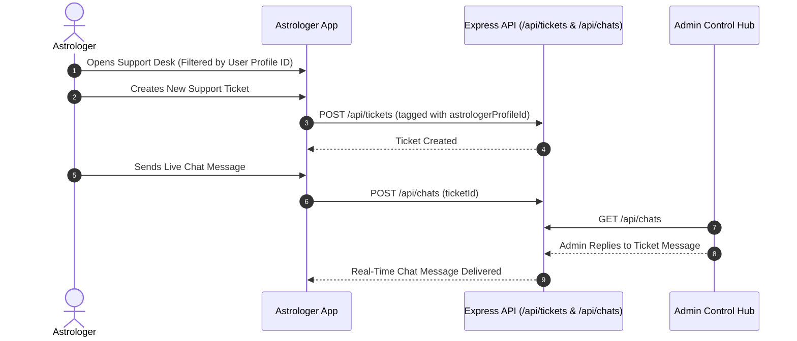
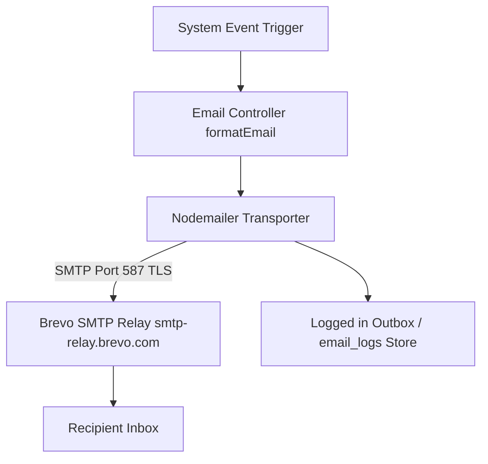

# 🔄 DEVSETU CONNECT — System Flow & Technical Architecture Guide

This document details the complete end-to-end technical system workflows and architectural data flows for **DEVSETU CONNECT**, based strictly on the current production codebase.

---

## 📑 Table of Contents
- [A. Overall Architecture](#a-overall-architecture)
- [B. Astrologer Registration Flow](#b-astrologer-registration-flow)
- [C. Astrologer Login Flow](#c-astrologer-login-flow)
- [D. Forgot PIN Flow](#d-forgot-pin-flow)
- [E. Pooja Browsing Flow](#e-pooja-browsing-flow)
- [F. Booking Creation Flow](#f-booking-creation-flow)
- [G. Payment Flow](#g-payment-flow)
- [H. Admin Payment Verification Flow](#h-admin-payment-verification-flow)
- [I. Booking Confirmation Flow](#i-booking-confirmation-flow)
- [J. Booking Completion Flow](#j-booking-completion-flow)
- [K. Support Ticket Flow](#k-support-ticket-flow)
- [L. Admin Management Flow](#l-admin-management-flow)
- [M. Notification Flow](#m-notification-flow)
- [N. SMTP Email Flow](#n-smtp-email-flow)
- [O. Logout/Session Flow](#o-logoutsession-flow)
- [P. Error/Failed-Operation Flows](#p-errorfailed-operation-flows)

---

## A. Overall Architecture

---

## B. Astrologer Registration Flow

---

## C. Astrologer Login Flow

---

## D. Forgot PIN Flow

---

## E. Pooja Browsing Flow

1. Client fetches available services from `/api/services`.
2. Services catalog rendered by categories (*Vedic Rituals, Dosh Nivaran, Graha Shanti, Kuber Rituals, Custom Poojas*).
3. Clicking a Pooja card opens package details (Pandit count, items included, duration, starting price, astrologer fee).

---

## F. Booking Creation Flow

---

## G. Payment Flow

---

## H. Admin Payment Verification Flow

1. Administrator logs into Control Hub (`#admin`).
2. Navigates to **Payment Verification Console** (`adminTab === "payments"`).
3. Reviews submitted 12-digit UTR against merchant UPI bank statements.
4. Action:
   - **Approve Payment**: Updates status to `approved`.
   - **Reject Payment**: Updates status to `rejected`.

---

## I. Booking Confirmation Flow

1. Admin approval updates booking status from `submitted` to `approved` or `scheduled`.
2. Server triggers automated transaction confirmation event.
3. Nodemailer sends confirmation email via Brevo SMTP Relay.
4. Astrologer sees booking status updated to `approved` in **My Bookings**.

---

## J. Booking Completion Flow

1. Ritual is physically performed by the Pandit / Astrologer at the designated temple or mandap.
2. Astrologer or Admin marks ritual status as `completed`.
3. System updates revenue statistics and logs completion in audit history.

---

## K. Support Ticket Flow

> **Privacy Control**: Astrologer queries are strictly filtered by `astrologerProfileId`. Astrologer A cannot view Astrologer B's tickets.

---

## L. Admin Management Flow

Administrator manages platform operations via 8 core sections:
1. **Dashboard Home**: 14 key platform metrics and trend charts.
2. **Astrologer Directory**: Account approvals, profile edits, PIN resets, suspensions.
3. **Payment Verification**: Review UTRs and confirm payments.
4. **Booking Operations**: Status management (`submitted`, `approved`, `scheduled`, `completed`, `rejected`, `cancelled`).
5. **Pooja Catalog**: Add new Poojas (EN/HI/MR multi-lingual) & delete obsolete services.
6. **Support Console**: Platform-wide ticket management.
7. **Audit Trails & Reports**: Financial reporting and audit logs.
8. **SMTP Email Controls**: Brevo delivery logs and health checks.

---

## M. Notification Flow

1. System event occurs (e.g., *Booking Created, Payment Verified, Ticket Replied*).
2. Notification object formatted with recipient ID, title, and message text.
3. Saved to `notifications` array / database collection.
4. Client polls `/api/debug/outbox` or `/api/notifications` and displays toast alert.

---

## N. SMTP Email Flow

---

## O. Logout / Session Flow

1. User clicks **"Log Out"**.
2. App executes `localStorage.removeItem("devsetu_user")` or `localStorage.removeItem("devsetu_admin_user")`.
3. Application resets active state variables to `null` and redirects to Login Screen.

---

## P. Error & Failed-Operation Flows

- **Invalid Login PIN**: Returns HTTP 401 `"Invalid Mobile Number or 6-digit Login PIN"`.
- **Missing Required Fields**: Client displays validation banner before form submission.
- **Database Connection Offline**: Automatically falls back to Firestore or `database.json`.
- **SMTP Transport Error**: Email failures logged cleanly in `email_logs` outbox without crashing server process.

---
*DEVSETU CONNECT — System Flow & Technical Architecture Guide v2.0 (Sanitized & Verified)*
